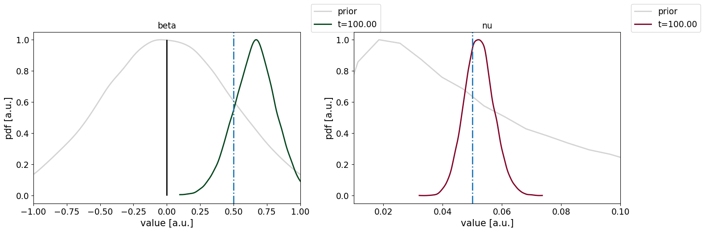

# BayesianSurvival
A basic package for modelling lifetimes via parameterised Bayesian survival analysis using the Cox proportional hazard assumption.

The modelling aims to assess a difference in lifetime between two datasets using proportional hazards and random censoring and provides a Bayes Factor hypothesis testing framework for assessing deviations from a null-model.

The survival likelihood function it evaluates is

With $D$ indicating the observed data (observed lifetime $t$, dataset indicator $x$ and event/censoring indicator $\delta$), $h_0$ the baseline hazard, ${\bf m}$ the baseline hazard model parameters, $S$ the surival function, $\beta$ the porportional hazard difference between the data: the parameter of interest.

More details can be found in XX.

Currently, 3 baseline hazard functions are implemented: Exponential, Weibull, and Gompertz.

The package include some visualisations to aid the modelling and visually assess the model fits using Kaplan-Meier curves. 

This package is requires python 3.11, pymc 5.16.1, arviz 0.17.1 and pandas 2.2.2.

BayesMinimalExample.py contains a Bayesian inference model on a minimal example of a singe synthetic dataset with right censoring and a constant baseline hazard rate.

BayesMinimalExample.py contains a Bayesian inference model on a minimal example of two synthetic datasets with random censoring, constant baseline hazard rate, and a fixed proportional hazard offset.

run_chemo.py and run_pembro.py show a simulation with real data and how inference can be done as new information becomes available (data not included). Please study the synthData.csv example for the data format the modelling requires.

Further work will focus on including covariates to the modelling.

